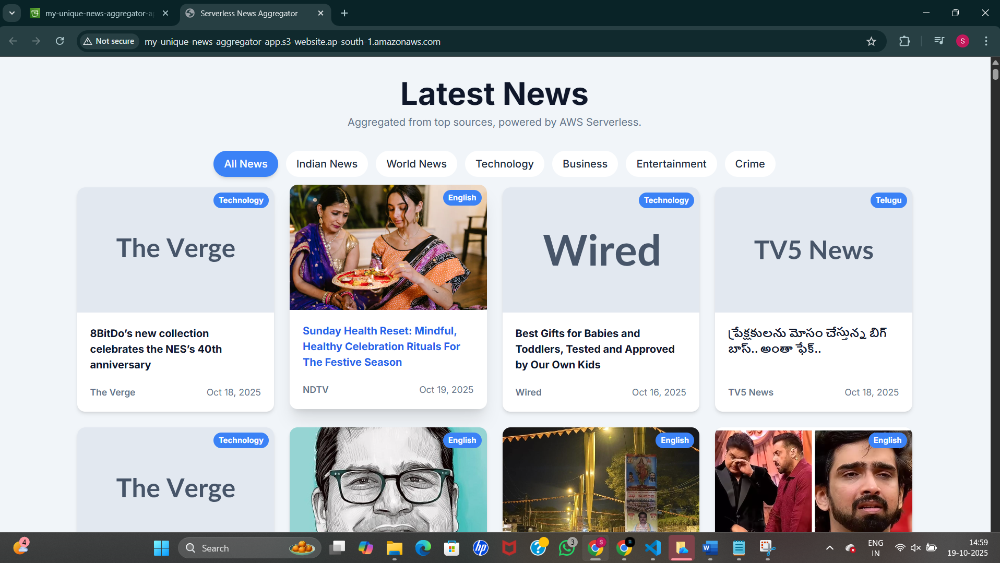

# Serverless News Aggregator 📰

A fully automated, event-driven news aggregator built on a 100% serverless AWS architecture. This application fetches news from global and regional sources every hour, processes multilingual content (English, Hindi, Telugu, Tamil, etc.), and serves it via a REST API to a responsive frontend.

## 🚀 Features

- Automated Data Pipeline: Fetches news automatically every hour using Amazon EventBridge and Lambda.

- Multilingual Support: specialized "Indian News" section with support for English, Hindi, Telugu, Malayalam, Kannada, and Tamil sources.

- Categorization: dynamically filters news by categories like Technology, Business, Entertainment, Crime, and World News.

- View Tracking: Real-time view counting for articles using a dedicated API endpoint and DynamoDB atomic updates.

- Cost-Effective: Zero idle server costs. You only pay for the compute time used during fetching and user requests.

- Responsive Design: Clean, modern UI built with HTML5, JavaScript, and Tailwind CSS.

## 🏗️ Architecture

- The application utilizes a decoupled, event-driven architecture to ensure scalability and maintainability.

- Ingestion: Amazon EventBridge triggers the FetchNewsFunction Lambda every hour.

- Processing: The Lambda function parses RSS feeds from 20+ sources using feedparser and updates Amazon DynamoDB.

- Storage: Amazon DynamoDB serves as the NoSQL store for articles (link as Partition Key) and view counts.

- API: Amazon API Gateway exposes REST endpoints (/news, /track-view) triggered by the frontend.

- Backend: The ApiHandlerFunction Lambda processes API requests, querying DynamoDB for news or updating view counts.

- Frontend: A static index.html site hosted on Amazon S3 consumes the API and renders the UI.

## 🛠️ Tech Stack

- Cloud Provider: Amazon Web Services (AWS)

- Compute: AWS Lambda (Python 3.9)

- Database: Amazon DynamoDB

- API Management: Amazon API Gateway (REST API)

- Storage/Hosting: Amazon S3 (Static Website Hosting)

- Orchestration: Amazon EventBridge (Scheduler)

- Frontend: HTML5, JavaScript (ES6+), Tailwind CSS

## 📂 Project Structure

├── fetch_news_lambda.py   # Lambda: Fetches RSS feeds & updates DB  
├── api_handler_lambda.py  # Lambda: Handles API requests (GET news, POST views)  
├── index.html             # Frontend: UI logic and API integration  
├── deployment_guide.md    # Detailed step-by-step AWS deployment instructions  
└── README.md              # Project documentation  

## 🚀 Deployment

- Prerequisites

- AWS Account

- AWS CLI (configured) or access to AWS Console

- Python 3.x installed locally

## Quick Start Guide

- Database: Create a DynamoDB table named NewsArticles with a partition key link (String).

- IAM: Create a Lambda execution role with permissions for CloudWatch Logs and DynamoDB access.

### Backend (Fetcher):

- Create a Lambda function FetchNewsFunction using fetch_news_lambda.py.

- Important: Install feedparser locally (pip install feedparser -t .) and zip the contents to upload.

- Set Environment Variable: DYNAMODB_TABLE = NewsArticles.

- Add an EventBridge trigger (Rate: 1 hour).

### Backend (API):

- Create a Lambda function ApiHandlerFunction using api_handler_lambda.py.

- Set Environment Variable: DYNAMODB_TABLE = NewsArticles.

### API Gateway:

- Create a REST API with resources /news (GET) and /track-view (POST).

- Connect them to the ApiHandlerFunction.

- Enable CORS for both resources.

- Deploy the API to a stage (e.g., prod) to get your Invoke URL.

### Frontend:

- Update index.html with your API Gateway Invoke URL.

- Upload index.html to an S3 bucket enabled for Static Website Hosting.

- Set the S3 bucket policy to allow public read access.

- For detailed instructions, please refer to deployment_guide.md.

## 🔮 Future Improvements

- AI Summarization: Integrate Amazon Bedrock to generate 3-line summaries for each article.

- User Personalization: Add Cognito authentication to allow users to save favorite categories.

- Sentiment Analysis: Use AWS Comprehend to tag articles as positive, neutral, or negative.

   

--- 
Developed with the help of Gemini
